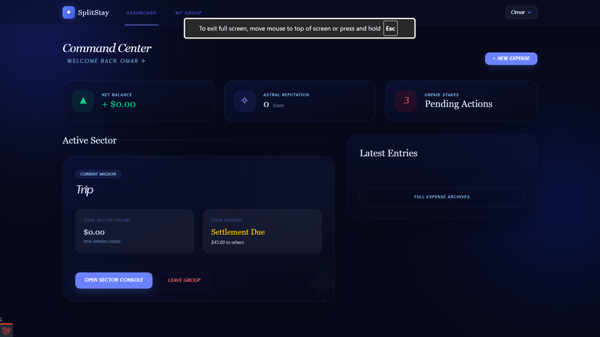
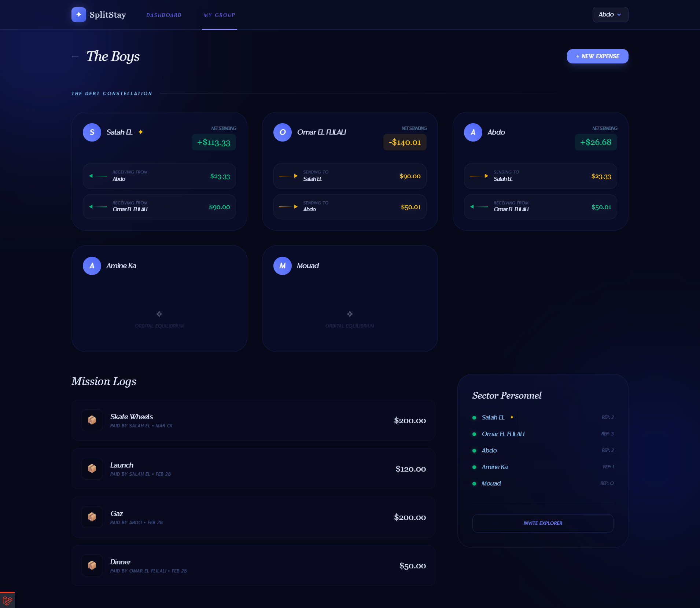

# EasyColoc

**EasyColoc** is a platform where users can manage money in groups. It takes care of calculating everything using a smart and optimized algorithm, so you can focus on your life and the important stuff while it handles the calculating and the divisions for users.

## Tech Stack

This project is built using modern web technologies:
- **Backend:** PHP & Laravel
- **Frontend:** Node.js, Vite
- **Styling:** Tailwind CSS

## Key Features

- **Smart Split Algorithm:** Automatically calculates and optimizes who owes whom, minimizing the number of transactions required within a group.
- **Group Management:** Easily create groups and add your friends or roommates to start tracking expenses together.
- **Dashboard Overview:** Keep track of total balances, recent expenses, and settlement statuses in one intuitive place.

### Dashboard Overview

Get a clear overview of your group's finances, recent transactions, and individual balances:

### Optimized Divisions

Let the smart algorithm calculate the most efficient way to settle debts between all members:

